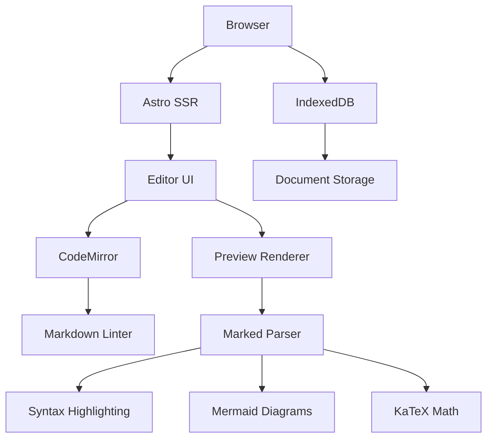
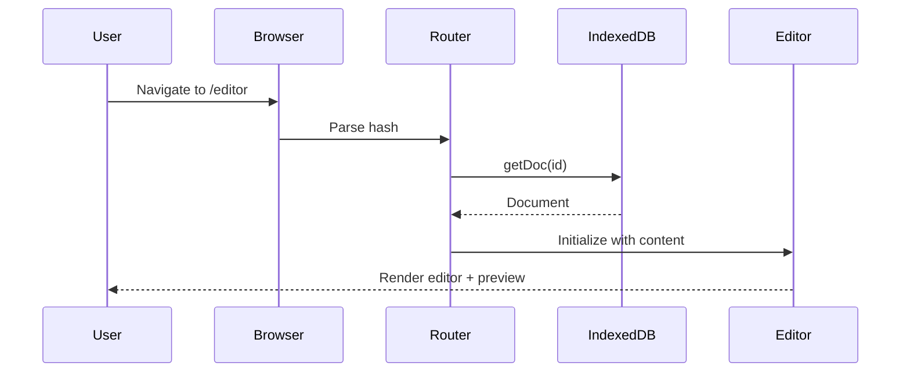
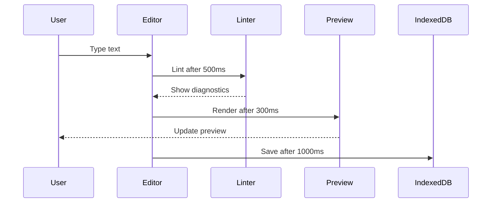

CodeInk is a modern, client-side Markdown editor built with a focus on performance, privacy, and developer experience. This guide explains the technical architecture and key design decisions.

## Architecture Overview

CodeInk follows a **100% client-side architecture** where all processing happens in the browser:



## Technology Stack

<CardGroup cols={2}>
  <Card title="Astro" icon="rocket">
    Static site generator with server-side rendering for optimal performance
  </Card>
  <Card title="TypeScript" icon="code">
    Type-safe development with full IDE support
  </Card>
  <Card title="Tailwind CSS" icon="paintbrush">
    Utility-first CSS framework via Vite plugin
  </Card>
  <Card title="Bun" icon="rabbit">
    Fast JavaScript runtime and package manager
  </Card>
</CardGroup>

### Core Dependencies

| Package | Purpose | Version |
|---------|---------|--------|
| `astro` | Framework | 5.17.1 |
| `codemirror` | Code editor | 6.0.1 |
| `marked` | Markdown parser | 17.0.1 |
| `shiki` | Syntax highlighting | 3.22.0 |
| `mermaid` | Diagram rendering | 11.12.2 |
| `katex` | Math rendering | 0.16.28 |
| `remark-lint` | Markdown linting | 10.0.1 |

## Core Systems

### 1. Editor System (CodeMirror)

The editor is powered by CodeMirror 6, a modern, extensible code editor:

<Accordion title="View source: src/scripts/codemirror-setup.ts">
```typescript
import { EditorState, Compartment } from "@codemirror/state"
import { EditorView, basicSetup } from "codemirror"
import { markdown } from "@codemirror/lang-markdown"
import { oneDark } from "@codemirror/theme-one-dark"
import { linter } from "@codemirror/lint"

const themeCompartment = new Compartment()

export function createEditor(parent: HTMLElement, initialDoc: string) {
  const state = EditorState.create({
    doc: initialDoc,
    extensions: [
      basicSetup,
      markdown({ addKeymap: true }),
      themeCompartment.of(getEditorThemeExtension(theme)),
      linter(markdownLint, { delay: 500 }),
      EditorView.updateListener.of((update) => {
        if (update.docChanged) {
          window.dispatchEvent(
            new CustomEvent("editor-change", {
              detail: { content: update.state.doc.toString() }
            })
          )
        }
      })
    ]
  })
  
  return new EditorView({ state, parent })
}
```
</Accordion>

**Key Features:**
- **Live linting** with 500ms debounce
- **Theme switching** via Compartment API
- **Change events** dispatched as CustomEvents
- **Markdown mode** with syntax-aware editing

### 2. Markdown Processing Pipeline

Markdown is processed through a multi-stage pipeline:

<Steps>
  <Step title="Parse">
    The `marked` library parses raw markdown into tokens:
    
    ```typescript
    import { marked } from "marked"
    const tokens = marked.lexer(markdown)
    ```
  </Step>

  <Step title="Extend">
    Extensions add support for advanced features:
    
    ```typescript
    marked.use(
      markedAlert(),           // GitHub-style alerts
      markedFootnote(),        // Footnote syntax
      markedKatex(),           // Math expressions
      gfmHeadingId()           // Auto-generate heading IDs
    )
    ```
  </Step>

  <Step title="Highlight">
    Code blocks are syntax-highlighted using Shiki:
    
    ```typescript
    async walkTokens(token) {
      if (token.type === "code") {
        const html = await highlightCode(token.text, token.lang)
        highlightMap.set(token.text, html)
      }
    }
    ```
  </Step>

  <Step title="Render">
    Tokens are converted to HTML with custom renderers:
    
    ```typescript
    const renderer = {
      code({ text, lang }) {
        if (lang === "mermaid") {
          return `<div class="mermaid">${text}</div>`
        }
        return highlightMap.get(text) ?? text
      }
    }
    ```
  </Step>
</Steps>

#### Markdown Extensions

<CardGroup cols={2}>
  <Card title="GitHub Alerts" icon="triangle-exclamation">
    ```markdown
    > [!NOTE]
    > Useful information
    ```
  </Card>
  <Card title="Footnotes" icon="arrow-down">
    ```markdown
    Text[^1]
    [^1]: Footnote content
    ```
  </Card>
  <Card title="Math (KaTeX)" icon="function">
    ```markdown
    Inline: $E = mc^2$
    Block: $$\sum_{i=1}^n$$
    ```
  </Card>
  <Card title="Mermaid Diagrams" icon="diagram-project">
    Flowcharts, sequence diagrams, ER diagrams, Gantt charts, and more using mermaid.js syntax.
  </Card>
</CardGroup>

### 3. Syntax Highlighting (Shiki)

CodeInk uses Shiki for accurate, VS Code-quality syntax highlighting:

<Accordion title="View source: src/lib/shiki/highlight.ts">
```typescript
import { createHighlighterCore } from "shiki/core"
import { createJavaScriptRegexEngine } from "shiki/engine/javascript"
import darkTheme from "@shikijs/themes/one-dark-pro"
import lightTheme from "@shikijs/themes/github-light"

const highlighter = await createHighlighterCore({
  themes: [darkTheme, lightTheme],
  langs: [],
  engine: createJavaScriptRegexEngine()
})

// Languages are loaded dynamically on-demand
const LANGUAGE_LOADERS = {
  js: () => import("@shikijs/langs/js"),
  python: () => import("@shikijs/langs/python"),
  // ... 60+ languages
}

async function ensureLanguageLoaded(lang) {
  if (!loadedLanguages.has(lang)) {
    const module = await LANGUAGE_LOADERS[lang]()
    highlighter.loadLanguage(module.default)
    loadedLanguages.add(lang)
  }
}
```
</Accordion>

**Optimization Strategy:**

1. **Lazy loading**: Languages loaded only when needed
2. **JavaScript engine**: No WebAssembly required
3. **Theme switching**: Both themes pre-loaded for instant switching
4. **Caching**: Highlighted code cached during markdown processing

### 4. Document Storage (IndexedDB)

Documents are stored locally using IndexedDB:

<Accordion title="View source: src/lib/db.ts">
```typescript
interface Document {
  id: string
  title: string
  customTitle?: string
  content: string
  createdAt: number
  updatedAt: number
}

const DB_NAME = "codeink-docs"
const STORE_NAME = "documents"

// Open database
function openDB(): Promise<IDBDatabase> {
  return new Promise((resolve, reject) => {
    const req = indexedDB.open(DB_NAME, 1)
    req.onupgradeneeded = () => {
      req.result.createObjectStore(STORE_NAME, { keyPath: "id" })
    }
    req.onsuccess = () => resolve(req.result)
  })
}

// Save document
export function saveDoc(doc: Document): Promise<void> {
  return withStore("readwrite", (store) => store.put(doc))
}
```
</Accordion>

**Storage Features:**
- Auto-save with 1-second debounce (src/scripts/editor.ts:18)
- Document title extracted from first heading
- UUIDs for document identification
- Sorted by `updatedAt` timestamp

### 5. Real-time Preview

The preview updates with a 300ms debounce (src/scripts/preview.ts:4):

```typescript
const DEBOUNCE_MS = 300

function initPreview(target: HTMLElement) {
  const handleEditorChange = (e: CustomEvent<{ content: string }>) => {
    if (debounceTimer) clearTimeout(debounceTimer)
    debounceTimer = setTimeout(async () => {
      await renderPreview(e.detail.content, target)
    }, DEBOUNCE_MS)
  }
  
  window.addEventListener("editor-change", handleEditorChange)
}
```

**Preview rendering pipeline:**

1. Editor emits `editor-change` event
2. Debounced render function called
3. Markdown processed to HTML
4. Mermaid diagrams initialized
5. Copy buttons attached to code blocks

### 6. Markdown Linting (Remark)

Real-time linting powered by remark-lint:

<Accordion title="View source: src/scripts/markdown-linter.ts">
```typescript
import { unified } from "unified"
import remarkParse from "remark-parse"
import remarkPresetLintRecommended from "remark-preset-lint-recommended"
import remarkStringify from "remark-stringify"

const processor = unified()
  .use(remarkParse)
  .use(remarkPresetLintRecommended)
  .use(remarkStringify, {
    bullet: "-",
    emphasis: "_",
    strong: "*"
  })

export function markdownLint(view: EditorView): Diagnostic[] {
  const text = view.state.doc.toString()
  const file = processor.processSync(text)
  
  return file.messages.map(msg => ({
    from: msg.place.start.offset,
    to: msg.place.end.offset,
    severity: msg.fatal ? "error" : "warning",
    message: msg.message
  }))
}
```
</Accordion>

**Lint Features:**
- One-click auto-fix button
- Real-time diagnostics with 500ms delay
- Status bar shows issue count
- Custom heading fix plugin (src/scripts/markdown-linter.ts:11-81)

## Data Flow

### Document Loading Flow



### Edit and Save Flow



## Build Configuration

The build is optimized for production deployment:

<Accordion title="View source: astro.config.mjs">
```javascript
export default defineConfig({
  site: 'https://codeink.app',
  output: 'server',
  adapter: cloudflare({
    imageService: 'compile'
  }),
  vite: {
    plugins: [tailwindcss()],
    build: {
      rollupOptions: {
        output: {
          manualChunks(id) {
            // Split vendor bundles
            if (id.includes("@codemirror/")) {
              return "vendor-codemirror"
            }
            if (id.includes("/marked/")) {
              return "vendor-marked"
            }
            if (id.includes("/remark-")) {
              return "vendor-remark"
            }
          }
        }
      }
    }
  }
})
```
</Accordion>

**Build Optimizations:**

- **Manual chunking**: Vendor libraries split into separate bundles
- **Code splitting**: Route-based automatic splitting
- **Tree shaking**: Unused code eliminated
- **Minification**: JavaScript and CSS minified
- **Compression**: Gzip/Brotli compression via Cloudflare

## Event System

CodeInk uses a custom event system for component communication:

| Event | Trigger | Purpose |
|-------|---------|--------|
| `editor-change` | Editor content changes | Update preview, status bar |
| `lint-update` | Lint diagnostic count changes | Update lint status display |
| `codeink-theme-change` | Theme toggled | Re-render editor and preview |
| `mermaid-rerender` | Theme changes | Re-initialize Mermaid diagrams |

Events are dispatched on `window` for global access:

```typescript
window.dispatchEvent(
  new CustomEvent("editor-change", {
    detail: { content: editorContent }
  })
)
```

## Performance Optimizations

<CardGroup cols={2}>
  <Card title="Debouncing" icon="clock">
    Preview (300ms), linting (500ms), auto-save (1000ms)
  </Card>
  <Card title="Lazy Loading" icon="loader">
    Shiki languages and Mermaid loaded on-demand
  </Card>
  <Card title="Code Splitting" icon="scissors">
    Vendor libraries in separate chunks
  </Card>
  <Card title="Memoization" icon="memory">
    Syntax highlighting cached during parse
  </Card>
</CardGroup>

## Security Model

<Warning>
  CodeInk processes all data client-side. Documents never leave the browser.
</Warning>

**Privacy Features:**
- No server-side processing
- No analytics or tracking
- No cookies required
- No user accounts
- Data stored in browser's IndexedDB only

## Next Steps

<CardGroup cols={2}>
  <Card title="Code Structure" icon="folder-tree" href="/development/code-structure">
    Explore the file organization
  </Card>
  <Card title="Contributing" icon="code-pull-request" href="/development/contributing">
    Start contributing to CodeInk
  </Card>
</CardGroup>
