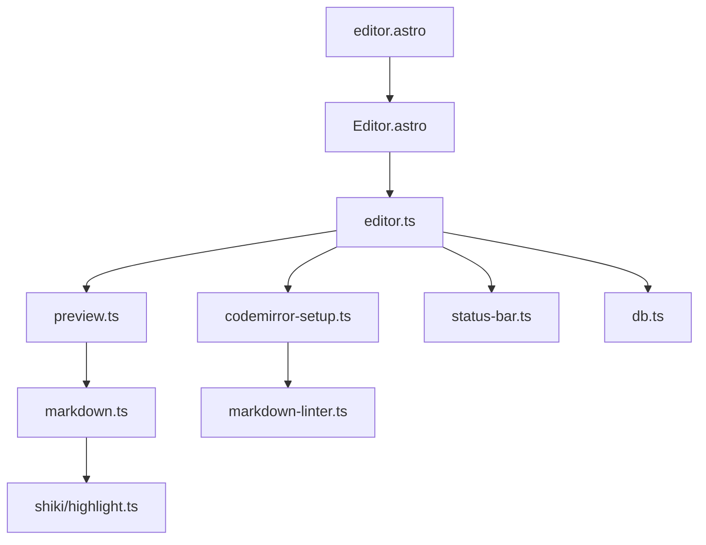

This guide provides a comprehensive overview of CodeInk's file structure and explains the purpose of each directory and key file.

## Repository Root

```
codeink/
├── src/                    # Source code
├── public/                 # Static assets
├── astro.config.mjs        # Astro configuration
├── package.json            # Dependencies and scripts
├── tsconfig.json           # TypeScript configuration
├── wrangler.toml           # Cloudflare deployment config
├── bun.lock               # Dependency lock file
├── README.md              # Project documentation
└── LICENSE                # MIT License
```

## Source Directory (`src/`)

The `src/` directory contains all application code:

```
src/
├── components/            # Reusable Astro components
├── layouts/               # Page layouts
├── pages/                 # Route pages (file-based routing)
├── scripts/               # Client-side TypeScript
├── lib/                   # Utility libraries and helpers
├── styles/                # Global CSS and themes
└── assets/                # SVG icons and images
```

## Components (`src/components/`)

Reusable UI components built with Astro:

<AccordionGroup>
  <Accordion title="Editor.astro">
    The main editor component containing:
    - CodeMirror editor pane
    - Preview pane
    - Resize handle between panes
    - Loading overlay
    - View mode management (editor/split/preview)
    
    **Location**: `src/components/Editor.astro`
    
    **Key Features**:
    - Responsive layout with mobile support
    - Sticky pane headers
    - Custom resize handle with hover effects
  </Accordion>

  <Accordion title="Header.astro">
    Top navigation bar with:
    - Logo and site title
    - View mode tabs (optional)
    - Theme toggle
    - Export button
    
    **Location**: `src/components/Header.astro`
  </Accordion>

  <Accordion title="StatusBar.astro">
    Bottom status bar displaying:
    - Save status (idle/saving/saved)
    - Markdown lint issues count
    - Auto-fix button
    
    **Location**: `src/components/StatusBar.astro`
  </Accordion>

  <Accordion title="ViewTabs.astro">
    Toggle buttons for view modes:
    - Editor only
    - Split view (default)
    - Preview only
    
    **Location**: `src/components/ViewTabs.astro`
  </Accordion>

  <Accordion title="ThemeToggle.astro">
    Button to switch between light and dark themes.
    
    **Location**: `src/components/ThemeToggle.astro`
  </Accordion>

  <Accordion title="CodeBlock.astro">
    Syntax-highlighted code block component used in content pages.
    
    **Location**: `src/components/CodeBlock.astro`
  </Accordion>

  <Accordion title="Card.astro & Button.astro">
    Reusable UI primitives for marketing/content pages.
    
    **Locations**: 
    - `src/components/Card.astro`
    - `src/components/Button.astro`
  </Accordion>
</AccordionGroup>

## Layouts (`src/layouts/`)

Page layout templates:

<Tabs>
  <Tab title="Layout.astro">
    **Base layout** for all pages.
    
    **Location**: `src/layouts/Layout.astro`
    
    **Includes**:
    - HTML document structure
    - Meta tags (SEO, Open Graph, Twitter)
    - Theme initialization script
    - Global styles import
    - Structured data (JSON-LD)
    
    **Usage**:
    ```astro
    ---
    import Layout from "@/layouts/Layout.astro"
    ---
    <Layout title="Page Title" description="Page description">
      <!-- Page content -->
    </Layout>
    ```
  </Tab>

  <Tab title="ContentLayout.astro">
    **Content page layout** for documentation and guides.
    
    **Location**: `src/layouts/ContentLayout.astro`
    
    **Features**:
    - Responsive content wrapper
    - Typography styles
    - Header and footer
  </Tab>
</Tabs>

## Pages (`src/pages/`)

File-based routing - each `.astro` file becomes a route:

| File | Route | Purpose |
|------|-------|--------|
| `index.astro` | `/` | Landing page |
| `editor.astro` | `/editor` | Main editor interface |
| `documents.astro` | `/documents` | Document management page |
| `about.astro` | `/about` | About page |
| `markdown-cheat-sheet.astro` | `/markdown-cheat-sheet` | Markdown syntax guide |
| `katex-math-guide.astro` | `/katex-math-guide` | KaTeX math reference |
| `mermaid-diagrams-guide.astro` | `/mermaid-diagrams-guide` | Mermaid diagram examples |
| `404.astro` | `/404` | Error page |
| `robots.txt.ts` | `/robots.txt` | SEO robots file |
| `llms.txt.ts` | `/llms.txt` | AI/LLM documentation |

## Scripts (`src/scripts/`)

Client-side TypeScript modules:

<Tabs>
  <Tab title="Core Editor">
    ### editor.ts
    **Main editor initialization and orchestration**
    
    **Location**: `src/scripts/editor.ts`
    
    **Responsibilities**:
    - Initialize CodeMirror editor
    - Load/create documents from URL hash
    - Set up auto-save (1 second debounce)
    - Connect editor to preview
    - Manage status bar state
    - Handle theme changes
    
    **Key Functions**:
    ```typescript
    export function initEditor(): void
    ```
  </Tab>

  <Tab title="CodeMirror Setup">
    ### codemirror-setup.ts
    **CodeMirror editor configuration**
    
    **Location**: `src/scripts/codemirror-setup.ts`
    
    **Exports**:
    ```typescript
    createEditor(parent: HTMLElement, initialDoc: string): EditorView
    destroyEditor(): void
    setEditorTheme(theme: "light" | "dark"): void
    getEditorContent(): string
    setEditorContent(content: string): void
    ```
    
    **Extensions**:
    - `basicSetup` - line numbers, search, etc.
    - `markdown` - Markdown language mode
    - `linter` - Real-time markdown linting
    - Theme compartment for dynamic switching
  </Tab>

  <Tab title="Preview System">
    ### preview.ts
    **Markdown preview rendering**
    
    **Location**: `src/scripts/preview.ts`
    
    **Exports**:
    ```typescript
    initPreview(target: HTMLElement): () => void
    renderPreview(content: string, target: HTMLElement): Promise<void>
    ```
    
    **Process**:
    1. Listen for `editor-change` events
    2. Debounce (300ms)
    3. Render markdown to HTML
    4. Initialize Mermaid diagrams
    5. Attach copy buttons to code blocks
  </Tab>

  <Tab title="Markdown Linting">
    ### markdown-linter.ts
    **Real-time markdown linting and auto-fix**
    
    **Location**: `src/scripts/markdown-linter.ts`
    
    **Exports**:
    ```typescript
    markdownLint(view: EditorView): Diagnostic[]
    fixMarkdown(text: string): string
    ```
    
    **Linting Rules**:
    - Uses `remark-preset-lint-recommended`
    - Custom heading fix plugin
    - Undefined reference checking
  </Tab>

  <Tab title="Other Scripts">
    ### mermaid-renderer.ts
    Initialize and render Mermaid diagrams in preview
    
    ### view-mode.ts
    Manage editor view modes (editor/split/preview)
    
    ### resize-handle.ts
    Handle draggable resize between editor and preview
    
    ### status-bar.ts
    Update status bar with save state and lint count
    
    ### export.ts
    Handle markdown export functionality
    
    ### documents.ts
    Document list management page logic
    
    ### copy-handler.ts
    Copy-to-clipboard for code blocks
    
    ### logo-loop.ts
    Animated logo on landing page
    
    ### landing-nav-cta.ts
    Landing page navigation interactions
  </Tab>
</Tabs>

## Libraries (`src/lib/`)

Shared utility code:

<CardGroup cols={2}>
  <Card title="db.ts" icon="database">
    **IndexedDB wrapper** for document storage
    
    **Exports**:
    - `getAllDocs(): Promise<Document[]>`
    - `getDoc(id: string): Promise<Document | null>`
    - `saveDoc(doc: Document): Promise<void>`
    - `deleteDoc(id: string): Promise<void>`
    
    **Location**: `src/lib/db.ts`
  </Card>

  <Card title="markdown.ts" icon="markdown">
    **Markdown processing pipeline**
    
    **Exports**:
    - `renderMarkdown(content: string): Promise<string>`
    - `extractTitle(content: string): string`
    
    **Features**:
    - Marked parser with extensions
    - Shiki syntax highlighting
    - Custom code block renderer
    - Mermaid diagram support
    
    **Location**: `src/lib/markdown.ts`
  </Card>

  <Card title="markdown-title.ts" icon="heading">
    **Extract document title** from markdown
    
    Extracts first heading (H1-H6) or falls back to "Untitled"
    
    **Location**: `src/lib/markdown-title.ts`
  </Card>

  <Card title="default-markdown.md" icon="file-lines">
    **Default document content** for new documents
    
    Imported as raw string: `import DEFAULT_MARKDOWN from "@/lib/default-markdown.md?raw"`
    
    **Location**: `src/lib/default-markdown.md`
  </Card>
</CardGroup>

### Shiki Highlighter (`src/lib/shiki/`)

<Tabs>
  <Tab title="highlight.ts">
    **Syntax highlighting engine**
    
    **Location**: `src/lib/shiki/highlight.ts`
    
    **Features**:
    - On-demand language loading
    - 60+ supported languages
    - Light and dark themes
    - Language aliases (js → javascript, etc.)
    
    **Main Export**:
    ```typescript
    highlightCode(code: string, lang?: string): Promise<string>
    ```
  </Tab>

  <Tab title="transformers.ts">
    **Shiki transformers** for custom rendering
    
    **Location**: `src/lib/shiki/transformers.ts`
    
    **Transformers**:
    - `showLineNumbers()` - Add line numbers
    - `wordWrapContent()` - Enable word wrapping
    - `addLanguageProperty()` - Add language data attribute
  </Tab>
</Tabs>

## Styles (`src/styles/`)

Global CSS organized by concern:

<CardGroup cols={2}>
  <Card title="global.css" icon="palette">
    Main stylesheet importing all other CSS files
    
    **Location**: `src/styles/global.css`
  </Card>

  <Card title="tokens.css" icon="swatchbook">
    CSS custom properties (design tokens):
    - Colors (background, foreground, primary, etc.)
    - Typography (font families, sizes)
    - Spacing and sizing
    - Border radius
    
    **Location**: `src/styles/tokens.css`
  </Card>

  <Card title="base.css" icon="foundation">
    Base element styles and resets
    
    **Location**: `src/styles/base.css`
  </Card>

  <Card title="prose.css" icon="paragraph">
    Typography styles for markdown preview
    
    Applied via `.markdown-prose` class
    
    **Location**: `src/styles/prose.css`
  </Card>

  <Card title="code.css" icon="code">
    Code block and syntax highlighting styles
    
    **Location**: `src/styles/code.css`
  </Card>

  <Card title="utilities.css" icon="toolbox">
    Custom utility classes
    
    **Location**: `src/styles/utilities.css`
  </Card>

  <Card title="integrations.css" icon="puzzle-piece">
    Styles for third-party integrations (Mermaid, KaTeX)
    
    **Location**: `src/styles/integrations.css`
  </Card>
</CardGroup>

## Assets (`src/assets/`)

Static SVG icons and images:

```
src/assets/
├── logo.svg                    # CodeInk logo
├── icons/
│   ├── tech/                   # Technology logos
│   │   ├── astro.svg
│   │   ├── bun.svg
│   │   ├── mermaid.svg
│   │   ├── tailwind.svg
│   │   └── ts.svg
│   └── toggle-theme.svg        # Theme toggle icon
```

## Public Directory (`public/`)

Static files served as-is:

```
public/
├── favicon.svg                 # Site favicon
├── favicon-192.png             # PWA icon (192x192)
├── favicon-512.png             # PWA icon (512x512)
├── apple-touch-icon.png        # iOS home screen icon
├── og-image.png                # Social media preview image
└── icons/
    └── lang/                   # Code language icons
        ├── default.svg
        ├── javascript.svg
        ├── python.svg
        ├── typescript.svg
        └── ... (60+ language icons)
```

## Configuration Files

<Tabs>
  <Tab title="astro.config.mjs">
    **Astro framework configuration**
    
    **Location**: `astro.config.mjs`
    
    **Key Settings**:
    ```javascript
    {
      site: 'https://codeink.app',
      output: 'server',
      adapter: cloudflare(),
      integrations: [sitemap()],
      vite: {
        plugins: [tailwindcss()],
        build: {
          rollupOptions: {
            output: {
              manualChunks() { /* ... */ }
            }
          }
        }
      }
    }
    ```
  </Tab>

  <Tab title="package.json">
    **Node.js package configuration**
    
    **Location**: `package.json`
    
    **Scripts**:
    - `dev` - Start development server
    - `lint` - Run type checking
    - `build` - Production build
    - `preview` - Preview production build
    
    **Key Dependencies**:
    - `astro` - Framework
    - `codemirror` - Editor
    - `marked` - Markdown parser
    - `shiki` - Syntax highlighter
    - `mermaid` - Diagrams
    - `katex` - Math rendering
  </Tab>

  <Tab title="tsconfig.json">
    **TypeScript configuration**
    
    **Location**: `tsconfig.json`
    
    **Settings**:
    - Path alias `@/*` → `src/*`
    - Strict type checking enabled
    - ES2022 target
  </Tab>

  <Tab title="wrangler.toml">
    **Cloudflare Pages deployment config**
    
    **Location**: `wrangler.toml`
    
    ```toml
    name = "codeink"
    compatibility_date = "2024-01-01"
    pages_build_output_dir = "dist"
    ```
  </Tab>
</Tabs>

## Import Aliases

CodeInk uses the `@/` alias for cleaner imports:

```typescript
// Instead of:
import { saveDoc } from "../../../lib/db"

// Use:
import { saveDoc } from "@/lib/db"
```

**Alias mapping** (tsconfig.json):
```json
{
  "compilerOptions": {
    "paths": {
      "@/*": ["./src/*"]
    }
  }
}
```

## File Naming Conventions

<CardGroup cols={2}>
  <Card title="Components" icon="puzzle-piece">
    **PascalCase** with `.astro` extension
    
    Examples: `Editor.astro`, `StatusBar.astro`
  </Card>

  <Card title="Scripts" icon="file-code">
    **kebab-case** with `.ts` extension
    
    Examples: `editor.ts`, `markdown-linter.ts`
  </Card>

  <Card title="Styles" icon="palette">
    **kebab-case** with `.css` extension
    
    Examples: `global.css`, `code.css`
  </Card>

  <Card title="Pages" icon="file">
    **kebab-case** with `.astro` extension
    
    Examples: `index.astro`, `markdown-cheat-sheet.astro`
  </Card>
</CardGroup>

## Key File Relationships

Understanding how files connect:



## Finding Code

<Tabs>
  <Tab title="By Feature">
    | Feature | Primary Files |
    |---------|---------------|
    | Editor | `components/Editor.astro`, `scripts/editor.ts`, `scripts/codemirror-setup.ts` |
    | Preview | `scripts/preview.ts`, `lib/markdown.ts` |
    | Storage | `lib/db.ts`, `scripts/editor.ts` |
    | Linting | `scripts/markdown-linter.ts` |
    | Highlighting | `lib/shiki/highlight.ts` |
    | Themes | `layouts/Layout.astro`, `styles/tokens.css` |
  </Tab>

  <Tab title="By Type">
    | Type | Location | Pattern |
    |------|----------|--------|
    | UI Components | `src/components/` | `*.astro` |
    | Pages/Routes | `src/pages/` | `*.astro` |
    | Client Scripts | `src/scripts/` | `*.ts` |
    | Utilities | `src/lib/` | `*.ts` |
    | Styles | `src/styles/` | `*.css` |
    | Icons | `src/assets/icons/` | `*.svg` |
  </Tab>

  <Tab title="By Layer">
    | Layer | Files |
    |-------|-------|
    | **Presentation** | `components/*.astro`, `layouts/*.astro` |
    | **Logic** | `scripts/*.ts`, `lib/*.ts` |
    | **Styling** | `styles/*.css` |
    | **Data** | `lib/db.ts` |
  </Tab>
</Tabs>

## Next Steps

<CardGroup cols={2}>
  <Card title="Setup" icon="rocket" href="/development/setup">
    Set up your development environment
  </Card>
  <Card title="Architecture" icon="sitemap" href="/development/architecture">
    Understand the technical architecture
  </Card>
  <Card title="Contributing" icon="code-pull-request" href="/development/contributing">
    Start contributing to CodeInk
  </Card>
</CardGroup>
