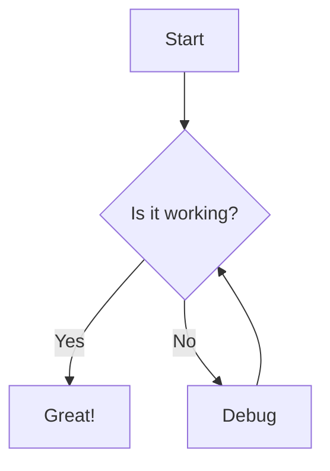
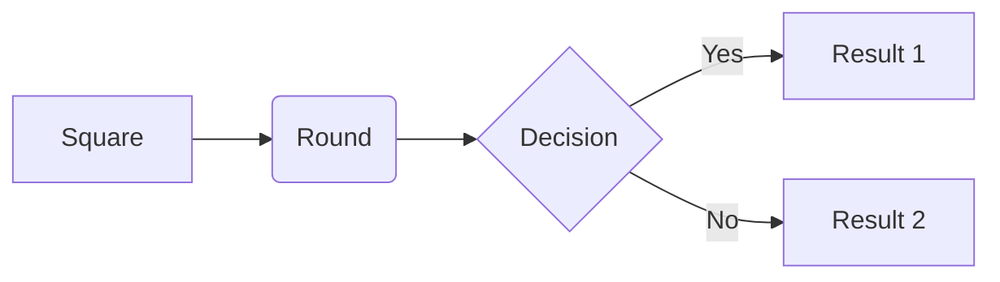
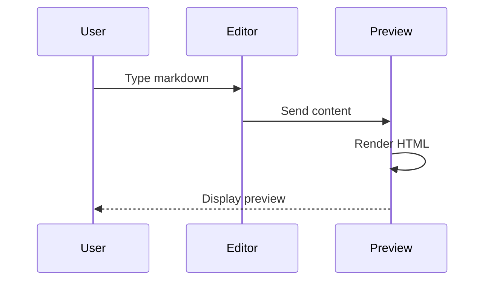
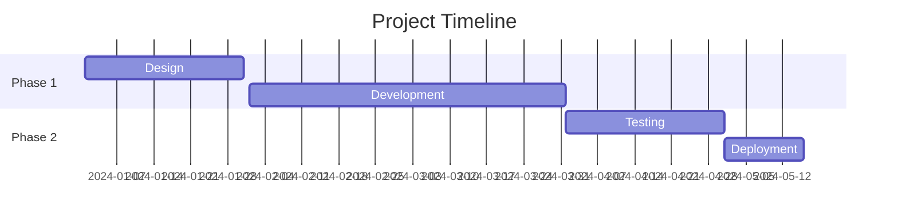

## Overview

CodeInk includes native support for **Mermaid**, allowing you to create professional diagrams using simple text-based syntax. All diagrams are rendered client-side with full theme support.

## Getting Started

### Basic Usage

Create diagrams using fenced code blocks with the `mermaid` or `mmd` language identifier:

````markdown

````

<Note>
Both `mermaid` and `mmd` language identifiers are supported and work identically.
</Note>

## Supported Diagram Types

### Flowcharts

Create process flows and decision trees:

````markdown

````

### Sequence Diagrams

Visualize interactions between components:

````markdown

````

### Gantt Charts

Project timelines and schedules:

````markdown

````

<Tip>
Gantt charts have special rendering optimizations in CodeInk for better layout.
</Tip>

### More Diagram Types

Mermaid supports many other diagram types:

<CardGroup cols={2}>
  <Card title="Class Diagrams" icon="diagram-project">
    UML class relationships and structures
  </Card>
  <Card title="State Diagrams" icon="circle-nodes">
    State machines and transitions
  </Card>
  <Card title="Entity Relationship" icon="database">
    Database schemas and relationships
  </Card>
  <Card title="User Journey" icon="route">
    User experience flows
  </Card>
  <Card title="Git Graphs" icon="code-branch">
    Git branch and merge visualization
  </Card>
  <Card title="Pie Charts" icon="chart-pie">
    Simple data visualization
  </Card>
</CardGroup>

## Theme Integration

### Automatic Theme Matching

Mermaid diagrams automatically match the application theme:

```typescript
function getMermaidTheme(): "dark" | "default" {
  const theme = document.documentElement.getAttribute("data-theme")
  return theme === "light" ? "default" : "dark"
}

mermaid.initialize({
  startOnLoad: false,
  theme: getMermaidTheme(),
  securityLevel: "loose",
})
```

### Dynamic Theme Updates

When you switch themes, diagrams are automatically re-rendered:

```typescript
window.addEventListener("codeink-theme-change", () => {
  // Clear processed flag from all diagrams
  const mermaidNodes = container.querySelectorAll(".mermaid[data-processed]")
  for (const node of mermaidNodes) {
    node.removeAttribute("data-processed")
  }
  
  // Trigger re-render
  window.dispatchEvent(new Event("mermaid-rerender"))
})
```

## Rendering System

### Lazy Loading

Mermaid is loaded on-demand when the first diagram is encountered:

```typescript
let mermaidPromise: Promise<typeof mermaidType> | null = null

function getMermaid() {
  mermaidPromise ??= import("mermaid").then((mod) => mod.default)
  return mermaidPromise
}
```

<Note>
This keeps the initial bundle size small and only loads Mermaid when actually needed.
</Note>

### Render Process

Diagrams are rendered asynchronously in the preview pane:

```typescript
export async function renderMermaidDiagrams(container: HTMLElement) {
  // Find unprocessed diagram nodes
  const unprocessedDivs = container.querySelectorAll(".mermaid:not([data-processed])")
  if (!unprocessedDivs.length) return

  const mermaid = await getMermaid()
  ensureMermaidInitialized(mermaid)

  // Render all diagrams
  await mermaid.run({
    nodes: Array.from(unprocessedDivs) as HTMLElement[],
    suppressErrors: true,
  })
}
```

### Visibility Detection

Diagrams are only rendered when the preview pane is visible:

```typescript
function isContainerVisible(container: HTMLElement): boolean {
  return container.offsetWidth > 0 && container.offsetHeight > 0
}

if (!isContainerVisible(container)) {
  watchForVisibility(container)
  return
}
```

This prevents rendering errors in hidden containers and improves performance.

### Resize Handling

A ResizeObserver watches for visibility changes:

```typescript
function watchForVisibility(container: HTMLElement) {
  if (resizeObserver) return

  resizeObserver = new ResizeObserver((entries) => {
    for (const entry of entries) {
      if (entry.contentRect.width > 0 && entry.contentRect.height > 0) {
        renderMermaidDiagrams(container)
      }
    }
  })

  resizeObserver.observe(container)
}
```

## Gantt Chart Optimization

### Special Handling

Gantt charts receive special width calculations for optimal display:

```typescript
const source = node.textContent?.trimStart() ?? ""
const isGantt = /^gantt\b/i.test(source)

if (isGantt) {
  node.classList.add("mermaid--gantt")
  
  const parentWidth = node.parentElement?.getBoundingClientRect().width
  const targetWidth = parentWidth && parentWidth > 0 ? parentWidth : containerWidth
  
  if (targetWidth > 0) {
    node.style.width = `${Math.floor(targetWidth)}px`
  }
}
```

### Custom Configuration

Gantt charts use custom padding and sizing:

```typescript
mermaid.initialize({
  gantt: {
    useMaxWidth: true,
    rightPadding: 75,
    leftPadding: 75,
    barHeight: 25,
    barGap: 4,
  },
})
```

## Error Handling

### Graceful Failures

Rendering errors are caught and logged without breaking the preview:

```typescript
try {
  await mermaid.run({
    nodes: Array.from(unprocessedDivs) as HTMLElement[],
    suppressErrors: true,
  })
} catch (error) {
  console.error("[Mermaid] Rendering error:", error)
}
```

<Warning>
Invalid Mermaid syntax will display an error message in the diagram container.
</Warning>

## Integration with Markdown

### Code Block Detection

Mermaid code blocks are detected during markdown parsing:

```typescript
const renderer = {
  code({ text, lang }: Tokens.Code) {
    const normalizedLang = (lang || "").toLowerCase()

    if (normalizedLang === "mermaid" || normalizedLang === "mmd") {
      return `<div class="mermaid">${text}</div>`
    }
    
    // Handle other languages...
  },
}
```

### Render Pipeline

1. Markdown is parsed and code blocks are converted to `<div class="mermaid">`
2. HTML is inserted into the preview pane
3. `renderMermaidDiagrams()` finds and processes unrendered diagrams
4. Mermaid transforms the text into SVG

## Performance

### Singleton Pattern

Only one Mermaid instance and ResizeObserver are created:

```typescript
let resizeObserver: ResizeObserver | null = null
let initialized = false
let currentTheme: "dark" | "default" | null = null
```

### Conditional Re-initialization

Mermaid is only re-initialized when the theme changes:

```typescript
function ensureMermaidInitialized(mermaid: typeof mermaidType) {
  const nextTheme = getMermaidTheme()
  if (initialized && currentTheme === nextTheme) return

  mermaid.initialize({ /* config */ })
  initialized = true
  currentTheme = nextTheme
}
```

### Debounced Rendering

A small delay prevents excessive re-renders:

```typescript
await new Promise((resolve) => setTimeout(resolve, 50))
```

## Source Code Reference

Implementation details can be found in:
- `/src/scripts/mermaid-renderer.ts` - Complete Mermaid rendering logic
- `/src/lib/markdown.ts` - Code block detection and HTML generation
- `/src/scripts/editor.ts` - Theme change handling and re-render triggers

## Related Features

- [Syntax Highlighting](/features/syntax-highlighting) - Code block highlighting
- [KaTeX Math](/features/katex-math) - Mathematical notation
- [CodeMirror Editor](/features/editor) - Main editing interface

## Learn More

For complete Mermaid syntax and examples, visit the [official Mermaid documentation](https://mermaid.js.org/).
