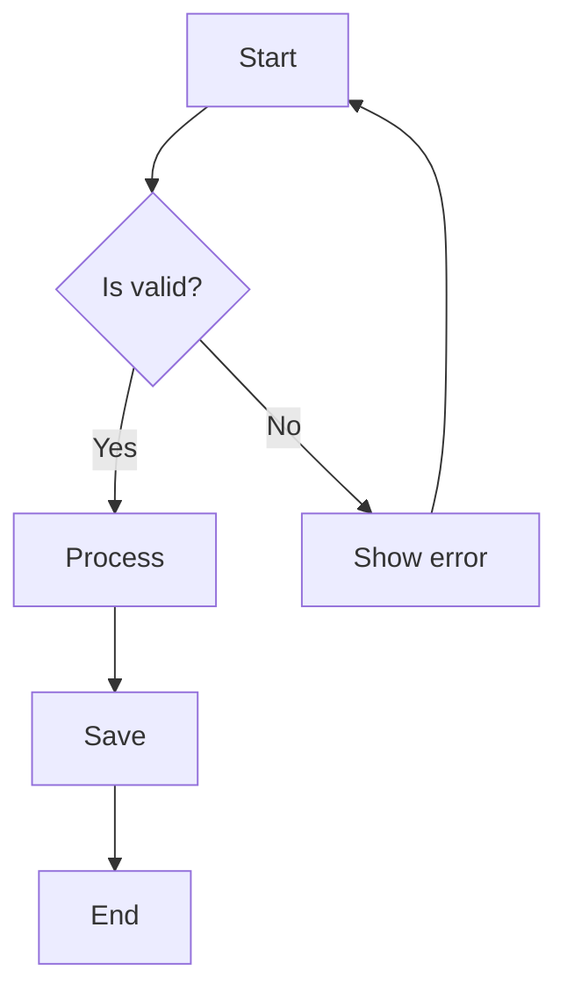

<div className="flex items-center gap-3 mb-6">
  <div className="inline-flex items-center gap-2 px-3.5 py-1.5 rounded-full border border-amber-500/20 bg-amber-500/5">
    <div className="w-2 h-2 rounded-full bg-amber-500 animate-pulse" />
    <span className="text-sm font-medium text-amber-500">100% Client-Side</span>
  </div>
  <div className="text-sm text-gray-600 dark:text-gray-400">Zero tracking • Zero accounts • Zero lock-in</div>
</div>

# Write Markdown. See it live.

CodeInk is a free, open-source online Markdown editor with real-time preview, syntax highlighting, Mermaid diagrams, and KaTeX math support. Built with privacy and performance in mind.

<CardGroup cols={2}>
  <Card title="Get started" icon="rocket" href="/quickstart">
    Create your first document in seconds. No signup required.
  </Card>
  <Card title="View on GitHub" icon="github" href="https://github.com/jorgefl8/CodeInk">
    Full source code available under MIT license.
  </Card>
</CardGroup>

## Why CodeInk?

CodeInk is designed for developers and technical writers who need a powerful Markdown editor without compromising privacy or requiring accounts.

<Columns cols={2}>
  <Card title="Private by architecture" icon="shield">
    Your documents are saved in IndexedDB. Nothing is transmitted, stored, or processed on any server. Zero tracking, zero cookies.
  </Card>
  <Card title="No accounts, no lock-in" icon="bolt">
    Open the editor and start writing. No signup, no subscriptions, no vendor lock-in. Your data stays under your control.
  </Card>
  <Card title="Built with modern tech" icon="code">
    Astro, CodeMirror 6, Shiki, and Tailwind CSS. Fast, lightweight, and works offline once cached.
  </Card>
  <Card title="Free & open source" icon="heart">
    MIT licensed. No premium tiers, no paywalls. Full source on GitHub.
  </Card>
</Columns>

## Core features

Everything you need to write technical Markdown, built into one clean interface.

### Real-time split-pane editor

Write Markdown on the left, see the rendered output on the right. Updates instantly as you type with live word count, line count, and character count in the status bar.

```typescript src/scripts/editor.ts
const AUTO_SAVE_DEBOUNCE_MS = 1000

const handleChange = ((e: CustomEvent<{ content: string }>) => {
  const content = e.detail.content
  updateStatusBar(content)
  setSaveState("saving")

  if (autoSaveTimer) clearTimeout(autoSaveTimer)
  autoSaveTimer = setTimeout(async () => {
    const doc: Document = {
      id: docId,
      title: extractTitle(content),
      content,
      createdAt,
      updatedAt: Date.now(),
    }
    await saveDoc(doc)
    setSaveState("saved")
  }, AUTO_SAVE_DEBOUNCE_MS)
}) as EventListener
```

<Note>
  Documents auto-save after 1 second of inactivity. Save status is displayed in the bottom-right corner of the editor.
</Note>

### Syntax highlighting via Shiki

Supports 16+ programming languages using the same highlighting engine as VS Code, with the One Dark Pro theme.

```python
def fibonacci(n: int) -> list[int]:
    """Generate Fibonacci sequence up to n terms."""
    if n <= 0:
        return []
    
    fib = [0, 1]
    for i in range(2, n):
        fib.append(fib[i-1] + fib[i-2])
    
    return fib[:n]
```

```rust
fn main() {
    let numbers = vec![1, 2, 3, 4, 5];
    
    let sum: i32 = numbers
        .iter()
        .filter(|&&x| x % 2 == 0)
        .sum();
    
    println!("Sum of evens: {}", sum);
}
```

### Mermaid diagrams

Render flowcharts, sequence diagrams, ER diagrams, Gantt charts, class diagrams, and more — all in real-time.



<Info>
  Mermaid diagrams are rendered client-side in the preview pane. They update automatically when you modify the diagram code.
</Info>

### KaTeX math

Render LaTeX math expressions inline and in display mode. Perfect for equations, matrices, and integrals.

Inline: $E = mc^2$ — Einstein's famous equation.

Display mode:

$$
\int_{-\infty}^{\infty} e^{-x^2} dx = \sqrt{\pi}
$$

$$
\begin{pmatrix}
a & b \\
c & d
\end{pmatrix}
\times
\begin{pmatrix}
e & f \\
g & h
\end{pmatrix}
=
\begin{pmatrix}
ae+bg & af+bh \\
ce+dg & cf+dh
\end{pmatrix}
$$

### Markdown linting with auto-fix

Real-time diagnostics via remark-lint with one-click auto-fix. CodeInk uses unified, remark-parse, and remark-preset-lint-recommended to catch common Markdown issues.

```typescript src/scripts/markdown-linter.ts
const processor = unified()
  .use(remarkParse)
  .use(remarkSmartHeadings) // Fix headings without spaces
  .use(remarkPresetLintRecommended)
  .use(remarkLintNoUndefinedReferences, {
    allow: [/^!/, "x", "X", " "],
  })
  .use(remarkStringify, {
    bullet: "-",
    emphasis: "_",
    strong: "*",
    listItemIndent: "one",
    rule: "-",
  })
```

<Tip>
  Click the "Fix" button in the status bar to automatically fix linting issues like missing spaces after heading markers or inconsistent list formatting.
</Tip>

### Local storage via IndexedDB

All documents are stored locally in your browser using IndexedDB. No server, no sync, complete privacy.

```typescript src/lib/db.ts
const DB_NAME = "codeink-docs"
const STORE_NAME = "documents"

export interface Document {
  id: string
  title: string
  customTitle?: string
  content: string
  createdAt: number
  updatedAt: number
}

export function getAllDocs(): Promise<Document[]> {
  return withStore("readonly", (store) => store.getAll(), (result) =>
    (result as Document[]).sort((a, b) => b.updatedAt - a.updatedAt),
  )
}
```

### Flexible view modes

Switch between split-pane, editor-only, and preview-only modes. Perfect for different workflows and screen sizes.

```typescript src/scripts/view-mode.ts
export type ViewMode = "split" | "editor" | "preview"

function setViewMode(mode: ViewMode) {
  editorRoot.setAttribute("data-view", mode)
  viewEditorBtn?.classList.toggle("active", mode === "editor")
  viewSplitBtn?.classList.toggle("active", mode === "split")
  viewPreviewBtn?.classList.toggle("active", mode === "preview")
}
```

<Note>
  On mobile devices (width < 640px), CodeInk automatically defaults to editor-only mode for better usability.
</Note>

### Export to Markdown

Download your documents as `.md` files with one click. Filenames are automatically generated from your document title.

```typescript src/scripts/export.ts
export function setupMarkdownExport(signal: AbortSignal) {
  exportMdBtn?.addEventListener("click", () => {
    const content = getEditorContent()
    const titleMatch = content.match(/^#\s+(.+)$/m)
    const title = titleMatch ? titleMatch[1].trim() : "document"
    const sanitized = title.replace(/[^a-z0-9\s-]/gi, "").replace(/\s+/g, "-")
    const filename = `${sanitized}.md`

    const blob = new Blob([content], { type: "text/markdown;charset=utf-8" })
    const url = URL.createObjectURL(blob)
    const link = document.createElement("a")
    link.href = url
    link.download = filename
    document.body.appendChild(link)
    link.click()
    document.body.removeChild(link)
    URL.revokeObjectURL(url)
  }, { signal })
}
```

## Technology stack

CodeInk is built with modern web technologies for performance and developer experience.

<CardGroup cols={3}>
  <Card title="Astro" icon="rocket">
    Static site generation with partial hydration
  </Card>
  <Card title="CodeMirror 6" icon="code">
    Modern editor with extension system
  </Card>
  <Card title="Shiki" icon="sparkles">
    VS Code-powered syntax highlighting
  </Card>
  <Card title="Mermaid" icon="diagram-project">
    Diagrams and flowcharts from text
  </Card>
  <Card title="KaTeX" icon="square-root-variable">
    Fast LaTeX math rendering
  </Card>
  <Card title="Tailwind CSS" icon="palette">
    Utility-first CSS framework
  </Card>
</CardGroup>

## Frequently asked questions

<AccordionGroup>
  <Accordion title="Is CodeInk free?">
    Yes, CodeInk is 100% free and open source. There are no premium tiers, no paywalls, and no feature restrictions. The full source code is available on [GitHub](https://github.com/jorgefl8/CodeInk).
  </Accordion>

  <Accordion title="Does CodeInk require an account?">
    No. Zero signup required. Open the editor and start writing. Your documents are saved locally in your browser via IndexedDB.
  </Accordion>

  <Accordion title="Is my data private in CodeInk?">
    Your documents never leave your browser. CodeInk runs 100% client-side with zero tracking and zero cookies. Nothing is stored on any server.
  </Accordion>

  <Accordion title="Does CodeInk support Mermaid diagrams?">
    Yes. CodeInk renders Mermaid diagrams in real-time directly in the preview pane. Supported types include flowcharts, sequence diagrams, ER diagrams, Gantt charts, class diagrams, and more.
  </Accordion>

  <Accordion title="Does CodeInk support math equations?">
    Yes. CodeInk supports KaTeX for rendering LaTeX math expressions inline (with `$...$`) and in display mode (with `$$...$$`).
  </Accordion>

  <Accordion title="Can I export my documents?">
    Yes. Click the export button in the editor to download your document as a `.md` file. The filename is automatically generated from your document's first heading.
  </Accordion>

  <Accordion title="Does CodeInk work offline?">
    Yes. Once CodeInk is cached by your browser, it works completely offline. All processing happens client-side.
  </Accordion>

  <Accordion title="How do I delete a document?">
    Navigate to the documents page and hover over the document you want to delete. Click the trash icon that appears in the top-right corner of the card.
  </Accordion>
</AccordionGroup>

## Get started

Ready to start writing? Follow the [quickstart guide](/quickstart) to create your first document.

<CardGroup cols={2}>
  <Card title="Quickstart" icon="rocket" href="/quickstart">
    Create your first document in seconds
  </Card>
  <Card title="GitHub Repository" icon="github" href="https://github.com/jorgefl8/CodeInk">
    Star us on GitHub and contribute
  </Card>
</CardGroup>
